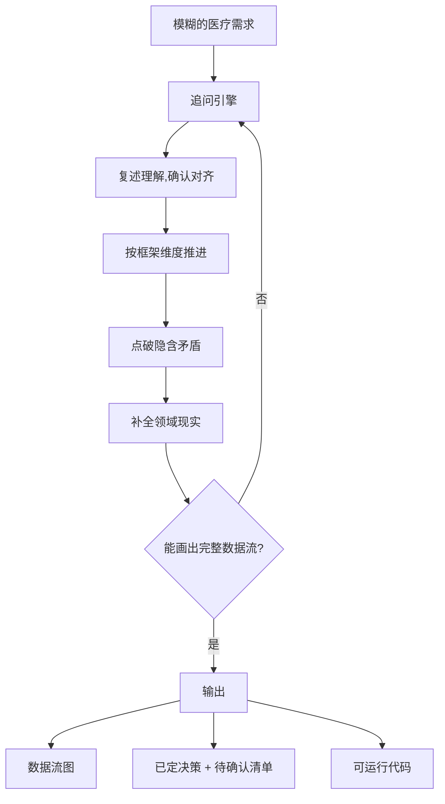

# med-req-prober

<p align="center">
  
  
  
  
  
  
</p>

说不清医疗软件需求时,让 AI 一步一步问清楚,然后直接产出可运行的代码。

面向想开发医疗软件、却讲不清需求的开发者。它把"我说不清"变成"我能答"——用一轮接一轮的小问题,把模糊想法翻译成可执行方案,再落成代码。

## 为什么需要它

描述医疗需求时,开发者往往说出的是**手段**,不是**目的**:

> "我要在 20x 扫描时加模型识别,存细胞坐标转真实物理坐标到缓存库,选区时一瞬间知道区域细胞构成。"

这句话里藏着一个真正的目标:"选区时一瞬间知道区域构成"。但通用 AI 缺医疗/硬件领域知识,补不上"坐标怎么换算""缓存和正式库什么关系""识别要跑在哪"这些隐含约束。med-req-prober 的存在,就是替开发者把这些缺口一个个问出来。

<p align="center">
  
  
  
</p>

<p align="center"><em>说不清 → 被问清 → 出方案</em></p>

## 工作方式

一个模糊需求进来,它用追问把它变清晰:



追问的样子:

```
开发者:我想优化登录界面,目前界面太普通不美观。

→ 这个登录界面是谁在用?
→ "太普通"具体是哪不满意?
→ 登录界面要显示哪些信息?

开发者:值班技师在用,想重新设计一版,产品号需要显示。

→ 技师是"天天登录"还是"开机一次就挂着"?
→ 将来要支持医院工牌扫码/刷卡吗?

开发者:开机登录一直保持,要预留扫码。

→ 输出:一版深色医疗质感的登录界面(可直接跑的 HTML)
```

## 核心资产:规则与框架,而非问题库

- **追问规则**:小问题、具体到界面/操作、一次一个、医学术语用大白话、按优先级推进、拆目标、收敛就停。
- **提问框架**:通用(目标→用户→主流程→数据→边界→交付),叠加扫描/影像、UI/登录两个品类。
- **推进机制**:复述对齐 → 按维度走 → 抓矛盾 → 注入现实 → 收敛。

框架决定"往哪问",机制决定"怎么问"。它不靠堆问题碰运气,而是接住任何需求。

## 如何使用

以 AI 编程助手在对话里读取本仓库的 `SKILL.md` 为前提。以下是各工具最省事的做法。

### Claude Code

```bash
# 方式一:克隆后告诉 Claude 读 SKILL.md
git clone git@github.com:AIHongDOU/med-req-prober.git
cd med-req-prober
claude   # 进入对话后说:读 SKILL.md,按它的规则追问我的需求
```

```bash
# 方式二:直接引入外部 skill 目录
git clone git@github.com:AIHongDOU/med-req-prober.git ~/.claude/skills/med-req-prober
```

### Codex (OpenAI)

```bash
git clone git@github.com:AIHongDOU/med-req-prober.git
cd med-req-prober
codex   # 对话里说:把 SKILL.md 当成系统提示,然后按它的流程问我
```

### Trae

1. 克隆仓库:`git clone git@github.com:AIHongDOU/med-req-prober.git`
2. 在 Trae 对话里粘贴 `SKILL.md` 全文,或说"按 /med-req-prober 的方式追问我的需求"。
3. 描述你的医疗需求即可,它会开始追问。

### Cursor

1. `git clone git@github.com:AIHongDOU/med-req-prober.git`
2. 将 `SKILL.md` 加入 `.cursor/rules/` 或粘贴进对话。
3. 说"用 med-req-prober 帮我问清楚这个需求"。

> 原则不变:无论哪个工具,**把 `SKILL.md` 交给 AI**,它就能按这套规则追问你的医疗需求。`references/` 和 `examples/` 是配套素材,按需读取。

## 仓库结构

```
med-req-prober/
├── SKILL.md              规则、框架、推进机制、输出协议
├── README.md
├── docs/images/          演示图
├── references/
│   ├── frameworks.md     提问框架展开版
│   └── question-bank.csv 实弹问题示例(可选)
└── examples/
    ├── 登录界面_新版.html  UI 输出示例(浏览器打开)
    └── stitch_demo.py     逻辑输出示例(python 自检)
```

## 已验证场景

- **100X 细胞分类** —— "100X 扫描时分类细胞类别" → 追问 → 数据流 → 40 分类方案
- **玻片拼接** —— "把 20x 图片拼成玻片系统" → 重叠区对齐 + 坐标映射 demo
- **登录界面** —— "登录界面太普通不美观" → 医疗质感登录界面 HTML

每个场景都由规则驱动完成——不是查问题库,而是按框架现场生成问题。

## Roadmap

- [x] 追问规则 + 提问框架(通用/扫描/UI)
- [x] 输出协议(数据流 + 可运行代码)
- [ ] 更多品类框架(影像 / 检验报告 / 数据合规)
- [ ] 金字塔切片拼接查看器
- [ ] 标准插件化(`.claude-plugin`)

## License

MIT
