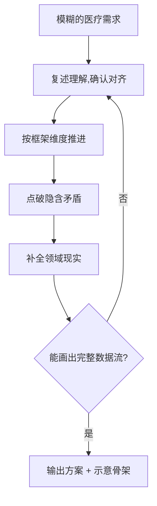

<p align="center">
  
</p>

<h1 align="center">DoctorWhy</h1>

<p align="center">
  <em>说不清的医疗需求,它替你一点一点问清楚,然后出示意骨架方案。</em>
</p>

<p align="center">
  
  
  
  
</p>

---

还在为"怎么跟 AI 讲医疗需求"发愁?你不是一个人。

你会说"我要在 100X 扫描的时候分类细胞",但说不清要**边拍边分**还是**拍完再分**、分类到什么粒度、结果给谁看。你说了一大段,AI 点头,然后写出一堆你不知道对不对的东西。

DoctorWhy 换个方式:它**不急着写**,它问你。

## 它怎么干活

你的需求越模糊,它越来劲:

```
开发者:我想在100X扫描的时候,可以分类细胞类别。

→ 分类是"边拍边分"还是"拍完再分"?
→ 你要分到什么程度?(粗分类 / 40分类骨髓学)
→ 结果给谁看?(出报告 / 辅助技师)
→ 扫描时分类拖慢0.5秒一张,能接受吗?

开发者:边拍边分,40分类,出报告医生看,不能拖慢。

→ 输出:数据流图 + 接口骨架 + 缓存/坐标方案
```

```
开发者:登录界面太普通不美观。

→ 这个登录界面是谁在用?
→ "太普通"具体是哪不满意?
→ 要显示产品名/型号/版本号吗?
→ 将来要支持工牌扫码/刷卡吗?

开发者:值班技师用,重新设计一版,要产品号,预留扫码。

→ 输出:一版能直接跑的医疗质感登录界面(HTML)
```

它问到你没想清楚的部分全想清楚,然后才动手。更多实弹产物在 [examples/](examples/)。

## 工作方式

一个模糊需求进来,它用追问把它问清楚:



- **追问规则**:小问题、具体到界面/操作、一次一个、医学术语用大白话、按优先级、拆目标、收敛就停。
- **提问框架**:通用(目标→用户→主流程→数据→边界→交付),叠加扫描/影像、UI/登录两个品类。
- **推进机制**:复述对齐 → 按维度走 → 抓矛盾 → 注入现实 → 收敛。

框架决定"往哪问",机制决定"怎么问"。它不靠堆问题碰运气,而是接住任何需求。

## 为什么不能直接丢给通用 AI

描述医疗需求时,开发者往往说出的是**手段**,不是**目的**:

> "我要在 20x 扫描时加模型识别,存细胞坐标转真实物理坐标到缓存库,选区时一瞬间知道区域细胞构成。"

这句话里藏着真正的目标:"选区时一瞬间知道区域构成"。但通用 AI 缺医疗/硬件领域知识,补不上"坐标怎么换算""缓存和正式库什么关系""识别要跑在哪"这些隐含约束。它替你把这些缺口一个个问出来。

## 医疗暗规则库

它比通用模型多知道的医疗现实,沉淀在 `references/` 下 8 类、80 条规则 —— 每条都标注"为什么问(医学现实)+ 踩过什么坑(真实事故)",并在追问时用它点破需求里的隐含矛盾。

| 类别 | 覆盖 |
|---|---|
| 器械 UI 规范 | 高对比/色盲警示/防误触/数据布局 |
| 数据与合规 | PHI/日志/审计/权限/加密/存储边界 |
| LIS/HL7 对接 | 消息结构/ORM-ORU/项目映射/ACK |
| 质控与校准 | 质控门槛/失控/试剂批次/校准追溯 |
| 监管记录与注册 | NMPA/21 CFR Part 11/IEC 62304 |
| 硬件约束 | 低倍先行/坐标标定/机械漂移/油镜异步 |
| 影像 pipeline | 金字塔切片/16-bit/重叠对齐 |
| 临床验证 | 敏感性/特异性/金标准/防泄漏 |
| 标本前处理与样本变量 | 禁欲/液化/稀释/抗凝/温控/双样本 |

**这是通用 AI 抄不走的护城河** —— 抄一套追问流程容易,积累 9 类医疗暗规则难。它来自真实医疗器械开发(MC-01 骨髓分析仪、精子分析、血细胞分析等真实项目)踩过的坑。

## 快速开始

最快的用法,一句话:

> 让 AI 读 `SKILL.md`,然后描述一个模糊的医疗需求,它就开始追问你。

完整安装见下方各工具分节。

## 安装

DoctorWhy 有两种形态,按需选择:

- **插件安装**(仅 Claude Code):像正规软件一样 `/plugin install`,能 `/doctorwhy` 手动调用、自动触发。推荐。
- **读即用**(所有工具):把 `SKILL.md` 交给任何 AI 助手,读完即生效。最通用,无安装门槛。

### Claude Code · 插件安装(推荐)

**前置**:装有 [Claude Code](https://docs.anthropic.com/claude-code) 且已登录。

第一步,添加 marketplace:

```
/plugin marketplace add AIHongDOU/DoctorWhy
```

第二步,安装插件:

```
/plugin install doctorwhy
```

安装成功后在对话里输入 `/doctorwhy:doctorwhy` 手动进入追问模式;或者直接抛一个模糊的医疗需求,它会自动触发。

**如果 `/plugin marketplace add` 弹了输入框**(部分版本要交互输入),直接粘贴 `git@github.com:AIHongDOU/DoctorWhy.git` 回车。

**如果 HTTPS 安装超时**:国内网络连 GitHub HTTPS 可能慢/超时。优先用 SSH 源(见上),或直接走下面的"读即用"。

### Claude Code · 读即用(备选)

```bash
git clone git@github.com:AIHongDOU/DoctorWhy.git
cd DoctorWhy
claude
```

进入后说:**"读 SKILL.md,按它的规则追问我的医疗需求"**。

### Codex (OpenAI)

**插件安装(推荐,支持斜杠调用):**

```bash
codex plugin marketplace add AIHongDOU/DoctorWhy
codex plugin add doctorwhy
```

装完在 Codex 会话里可用 `@doctorwhy`(Codex 的 skill 调用方式)触发。

**读即用(备选):**

```bash
git clone git@github.com:AIHongDOU/DoctorWhy.git
cd DoctorWhy
codex
```

进入后说:**"把 SKILL.md 当成系统提示,然后按它的流程追问我的需求"**。

### Trae

```bash
git clone git@github.com:AIHongDOU/DoctorWhy.git
```

在 Trae 对话里:粘贴 `SKILL.md` 全文,或说"按 /doctorwhy 的方式追问我的需求"。

### Cursor

```bash
git clone git@github.com:AIHongDOU/DoctorWhy.git
cp DoctorWhy/.cursor/rules/doctorwhy.mdc .cursor/rules/doctorwhy.mdc
```

把 `doctorwhy.mdc` 放进项目 `.cursor/rules/`(或全局),Cursor 会自动应用。然后说:"用 DoctorWhy 帮我问清楚这个需求"。

### Gemini CLI

```bash
gemini extensions install https://github.com/AIHongDOU/DoctorWhy
```

装后 `AGENTS.md` 作为常驻上下文自动加载,检测到模糊医疗需求即触发。

### 通用原则

无论哪个工具:**把 `SKILL.md` 交给 AI**,它就能按这套规则追问你的医疗需求。`references/` 和 `examples/` 是配套素材。

**描述清楚的需求不需要走追问** —— 只有说不清时才需要它。

### 卸载(Claude Code 插件)

```
/plugin uninstall doctorwhy
```

### 常见问题

**装不上 / 报错怎么办?**
- 网络超时 → 优先 SSH 源,或直接"读即用"(任何工具都能用,零安装)。
- marketplace 解析失败 → 确认你装的是最新版,`/plugin marketplace update AIHongDOU/DoctorWhy` 后再装。
- 命令名 → 插件 skill 是 `插件名:skill名` 格式,输入 `/doctorwhy:doctorwhy`,或直接抛需求自动触发。

## 仓库结构

```
DoctorWhy/
├── SKILL.md              规则、框架、推进机制、输出协议
├── README.md
├── .claude-plugin/       Claude Code 插件(plugin.json / marketplace.json)
├── .codex-plugin/        Codex 插件(plugin.json)
├── .cursor/rules/        Cursor rules(doctorwhy.mdc)
├── gemini-extension.json Gemini CLI 扩展
├── AGENTS.md             Gemini/多工具常驻上下文
├── skills/               Codex skill 载体(doctorwhy/SKILL.md + references)
├── docs/images/          logo、演示图
├── references/
│   ├── rules-device-ui.md  暗规则库·器械 UI 规范(核心资产)
│   ├── rules-compliance.md 暗规则库·数据与合规(核心资产)
│   ├── rules-lis-hl7.md    暗规则库·LIS/HL7 对接(核心资产)
│   ├── rules-qc-calibration.md 暗规则库·质控与校准(核心资产)
│   ├── rules-regulatory.md  暗规则库·监管记录与注册(核心资产)
│   ├── rules-hardware.md    暗规则库·硬件约束(核心资产)
│   ├── rules-imaging.md     暗规则库·影像 pipeline(核心资产)
│   ├── rules-clinical-validation.md 暗规则库·临床验证(核心资产)
│   ├── rules-specimen.md    暗规则库·标本前处理与样本变量(核心资产)
│   └── question-bank.csv   实弹问题示例(可选)
└── examples/
    ├── 登录界面_新版.html  UI 输出示例(浏览器打开)
    └── stitch_demo.py     逻辑输出示例(python 自检)
```

## FAQ

**它和"直接把需求丢给通用 AI"有什么区别?**
通用 AI 会顺着你的话往下编。它会在你觉得对的时候停下来问你——问到你暴露真正的问题。

**要配置吗?**
不用。把 `SKILL.md` 交给 agent 就行。

**问烦了怎么办?**
它只问你没想清楚的部分。你想清楚的,它不重复问。

## Roadmap

- [x] 追问规则 + 提问框架(通用/扫描/UI)
- [x] 输出协议(数据流 + 示意骨架)
- [x] 插件化(Claude Code / Codex / Cursor / Gemini CLI)
- [ ] 更多品类框架(影像 / 检验报告 / 数据合规)
- [ ] 金字塔切片拼接查看器
- [ ] 更多工具适配(OpenCode / Copilot / 其他)

## License

[MIT](LICENSE)。允许自由使用、修改、商用(保留版权声明即可)。
