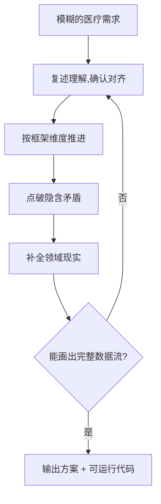

<p align="center">
  
</p>

<h1 align="center">med-req-prober</h1>

<p align="center">
  <em>说不清的医疗需求,它替你一点一点问清楚,然后直接写代码。</em>
</p>

<p align="center">
  
  
  
  
</p>

---

还在为"怎么跟 AI 讲医疗需求"发愁?你不是一个人。

你会说"我要在 100X 扫描的时候分类细胞",但说不清要**边拍边分**还是**拍完再分**、分类到什么粒度、结果给谁看。你说了一大段,AI 点头,然后写出一堆你不知道对不对的东西。

med-req-prober 换个方式:它**不急着写**,它问你。

## 它怎么干活

你的需求越模糊,它越来劲:

```
开发者:我想在100X扫描的时候,可以分类细胞类别。

→ 分类是"边拍边分"还是"拍完再分"?
→ 你要分到什么程度?(粗分类 / 40分类骨髓学)
→ 结果给谁看?(出报告 / 辅助技师)
→ 扫描时分类拖慢0.5秒一张,能接受吗?

开发者:边拍边分,40分类,出报告医生看,不能拖慢。

→ 输出:数据流图 + 接口骨架 + 缓存/坐标方案
```

```
开发者:登录界面太普通不美观。

→ 这个登录界面是谁在用?
→ "太普通"具体是哪不满意?
→ 要显示产品名/型号/版本号吗?
→ 将来要支持工牌扫码/刷卡吗?

开发者:值班技师用,重新设计一版,要产品号,预留扫码。

→ 输出:一版能直接跑的医疗质感登录界面(HTML)
```

它问到你没想清楚的部分全想清楚,然后才动手。更多实弹产物在 [examples/](examples/)。

## 工作方式

一个模糊需求进来,它用追问把它问清楚:



- **追问规则**:小问题、具体到界面/操作、一次一个、医学术语用大白话、按优先级、拆目标、收敛就停。
- **提问框架**:通用(目标→用户→主流程→数据→边界→交付),叠加扫描/影像、UI/登录两个品类。
- **推进机制**:复述对齐 → 按维度走 → 抓矛盾 → 注入现实 → 收敛。

框架决定"往哪问",机制决定"怎么问"。它不靠堆问题碰运气,而是接住任何需求。

## 为什么不能直接丢给通用 AI

描述医疗需求时,开发者往往说出的是**手段**,不是**目的**:

> "我要在 20x 扫描时加模型识别,存细胞坐标转真实物理坐标到缓存库,选区时一瞬间知道区域细胞构成。"

这句话里藏着真正的目标:"选区时一瞬间知道区域构成"。但通用 AI 缺医疗/硬件领域知识,补不上"坐标怎么换算""缓存和正式库什么关系""识别要跑在哪"这些隐含约束。它替你把这些缺口一个个问出来。

## 如何使用

以 AI 编程助手在对话里读取本仓库的 `SKILL.md` 为前提。

### Claude Code

```bash
git clone git@github.com:AIHongDOU/med-req-prober.git
cd med-req-prober
claude   # 说:读 SKILL.md,按它的规则追问我的需求
```

### Codex (OpenAI)

```bash
git clone git@github.com:AIHongDOU/med-req-prober.git
cd med-req-prober
codex   # 说:把 SKILL.md 当成系统提示,然后按它的流程问我
```

### Trae / Cursor

```bash
git clone git@github.com:AIHongDOU/med-req-prober.git
```

- **Trae**:对话里粘贴 `SKILL.md` 全文,或说"按 /med-req-prober 的方式追问我的需求"。
- **Cursor**:把 `SKILL.md` 加入 `.cursor/rules/` 或粘贴进对话,说"用 med-req-prober 帮我问清楚这个需求"。

> 原则不变:无论哪个工具,**把 `SKILL.md` 交给 AI**,它就能按这套规则追问你的医疗需求。`references/` 和 `examples/` 是配套素材。

## 仓库结构

```
med-req-prober/
├── SKILL.md              规则、框架、推进机制、输出协议
├── README.md
├── docs/images/          logo、演示图
├── references/
│   ├── rules-device-ui.md 暗规则库·器械 UI 规范(核心资产)
│   └── question-bank.csv  实弹问题示例(可选)
└── examples/
    ├── 登录界面_新版.html  UI 输出示例(浏览器打开)
    └── stitch_demo.py     逻辑输出示例(python 自检)
```

## FAQ

**它和"直接把需求丢给通用 AI"有什么区别?**
通用 AI 会顺着你的话往下编。它会在你觉得对的时候停下来问你——问到你暴露真正的问题。

**要配置吗?**
不用。把 `SKILL.md` 交给 agent 就行。

**问烦了怎么办?**
它只问你没想清楚的部分。你想清楚的,它不重复问。

## Roadmap

- [x] 追问规则 + 提问框架(通用/扫描/UI)
- [x] 输出协议(数据流 + 可运行代码)
- [ ] 更多品类框架(影像 / 检验报告 / 数据合规)
- [ ] 金字塔切片拼接查看器
- [ ] 标准插件化(`.claude-plugin`)

## License

[MIT](LICENSE)。允许自由使用、修改、商用(保留版权声明即可),与麻省理工学院无关。
