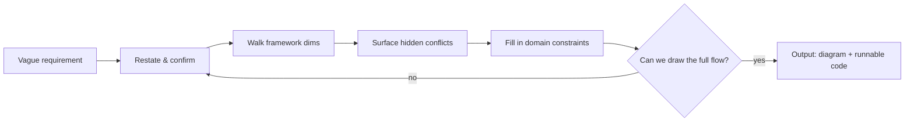

<p align="center">
  
</p>

<h1 align="center">med-req-prober</h1>

<p align="center">
  <em>You can't quite explain your medical software requirement. It keeps asking until you both get it — then it writes the code.</em>
</p>

<p align="center">
  
  
  
  
</p>

---

Struggling to explain your medical software idea to an AI? You're not alone.

You say *"I want to classify cells during 100X scanning"* — but not whether it should run **while capturing** or **afterwards**, how granular the classes are, or who consumes the result. You type a long paragraph, the AI nods, and writes something you can't verify.

med-req-prober does the opposite. It doesn't rush to write. **It asks first.**

## How it works

The fuzzier your requirement, the more it digs:

```
Developer: I want to classify cell types during 100X scanning.

→ Classify while capturing, or after the scan finishes?
→ How granular? (rough classes / 40-class bone-marrow differential)
→ Who reads the result? (automated report / technician review)
→ Classification slows each frame by 0.5s — acceptable?

Developer: While capturing. 40 classes. Doctor-reviewed report. Must not block.

→ Output: data-flow diagram + interface skeleton + cache/coordinate design
```

```
Developer: The login screen looks plain and dated.

→ Who uses it? (lab technician / instrument operator)
→ What exactly looks off?
→ Show product name / model / version?
→ Plan for ID-card / QR login later?

Developer: Technicians, want a redesign, show the model, reserve card login.

→ Output: a runnable medical-grade login screen (HTML)
```

More live examples in [examples/](examples/).

## The probing loop

A vague requirement in, a clear spec out — one question at a time:

<p align="center">
  
</p>

Under the hood, the loop is a clean pipeline:



## Why not just hand it to a generic AI

Developers state **how**, not **why**:

> "Add model inference during 20x scanning, store cell coordinates converted to physical coordinates in a cache, so I instantly know the cell composition of an area when I select it."

The real goal buried in there: *"instantly know area composition when selecting."* A generic AI lacks the medical/hardware knowledge to infer the missing constraints — how coordinates map, how cache relates to the main store, where inference runs. med-req-prober surfaces those gaps one question at a time.

## Rules and frameworks, not a question bank

- **Asking rules**: small questions, concrete to screen/operation, one decision at a time, plain language for medical jargon, priority-ordered, goal extraction, stop when converged.
- **Probing frameworks**: a generic one (goal → user → main flow → data → edge cases → delivery), plus scanning/imaging and UI/login variants.
- **Driving loop**: restate → walk the framework → surface conflicts → inject domain reality → converge.

The framework says *where to ask*; the loop says *how to ask*. No reliance on a canned question bank — it handles any requirement.

## Install

Point your AI coding assistant at `SKILL.md` in this repo.

### Claude Code

```bash
git clone git@github.com:AIHongDOU/med-req-prober.git
cd med-req-prober
claude   # then: read SKILL.md and probe my requirement per its rules
```

### Codex (OpenAI)

```bash
git clone git@github.com:AIHongDOU/med-req-prober.git
cd med-req-prober
codex   # then: treat SKILL.md as a system prompt and probe per its flow
```

### Trae / Cursor

```bash
git clone git@github.com:AIHongDOU/med-req-prober.git
```

- **Trae**: paste `SKILL.md` into the chat, or say "probe my requirement the med-req-prober way".
- **Cursor**: drop `SKILL.md` into `.cursor/rules/` or paste it in, then say "use med-req-prober to clarify this requirement".

> The rule is the same everywhere: **give the AI `SKILL.md`** and it will probe your medical requirement. `references/` and `examples/` are supporting material.

## Repository layout

```
med-req-prober/
├── SKILL.md              rules, frameworks, driving loop, output contract
├── README.md
├── docs/images/          logo, demo images
├── references/
│   ├── frameworks.md     expanded probing frameworks
│   └── question-bank.csv live-probed example questions (optional)
└── examples/
    ├── login-screen.html UI output example (open in a browser)
    └── stitch_demo.py    logic output example (python self-check)
```

## FAQ

**How is this different from dumping my requirement on a generic AI?**
A generic AI rolls with whatever you said. This stops and asks when things are off — until you surface the real problem.

**Does it need configuration?**
No. Hand it `SKILL.md` and it's ready.

**What if it asks too much?**
It only asks about parts you haven't thought through. What you've already decided, it leaves alone.

## Roadmap

- [x] Asking rules + probing frameworks (generic / scanning / UI)
- [x] Output contract (data flow + runnable code)
- [ ] More frameworks (imaging / lab reports / data compliance)
- [ ] Pyramid-tile stitch viewer
- [ ] Standard plugin packaging (`.claude-plugin`)

## License

[MIT](LICENSE).
